# DryBox IoT: Sistema de Monitoramento e Preservação de Filamentos

| | |
|:-------------------------:|:-------------------------:|
|  | 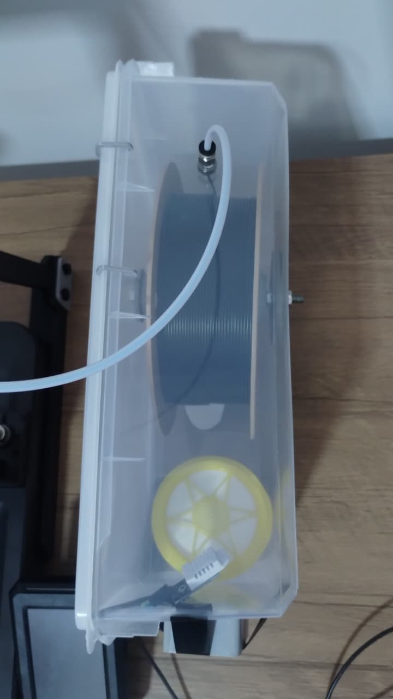 |

## Visão Geral

O projeto **DryBox IoT** consiste em uma solução de hardware e software para o armazenamento monitoramento de filamentos para impressão 3D.

Filamentos termoplásticos, como o PLA, são higroscópicos e tendem a absorver a umidade do ambiente. A água absorvida transforma-se em vapor durante o processo de extrusão, criando tensões internas, falhas estruturais e tornando o material quebradiço. Este projeto mitiga esses problemas mantendo o filamento em um ambiente controlado e monitorado remotamente.

## Funcionalidades

* **Monitoramento em Tempo Real:** Leitura contínua de temperatura e umidade relativa interna via sensor DHT22.
* **Conectividade IoT:** Utilização do microcontrolador ESP32 para processamento de dados e conectividade Wi-Fi/Bluetooth.
* **Interface de Monitoramento:** Dashboard visual que categoriza a qualidade do ambiente de armazenamento.
* **Desumidificação Passiva:** Integração com desumidificadores químicos (Cloreto de Cálcio) para redução ativa da umidade.

## Interface do Sistema

O sistema disponibiliza uma interface gráfica para visualização rápida dos parâmetros ambientais.

| Status Ideal | Status de Atenção | Status Crítico |
| :---: | :---: | :---: |
| 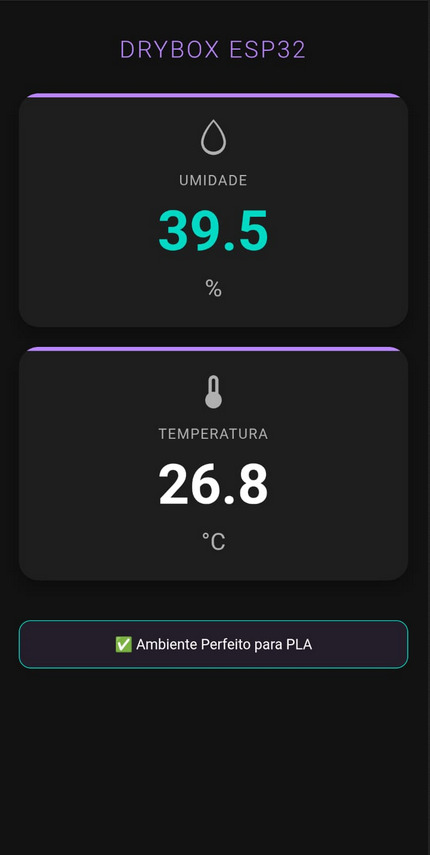 | 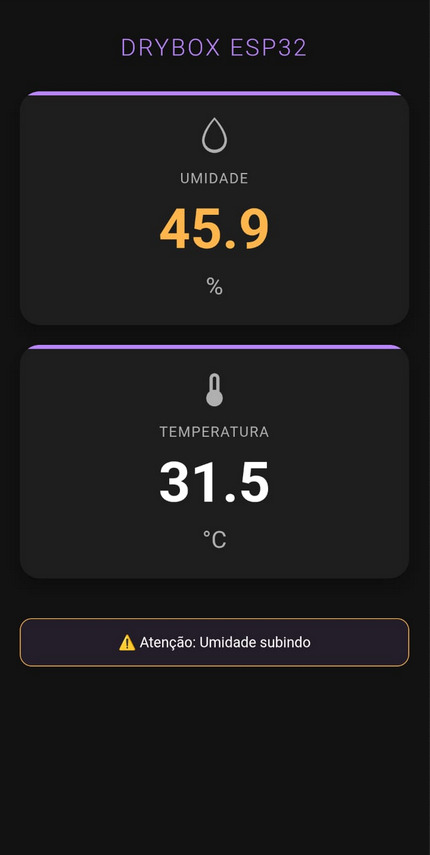 | 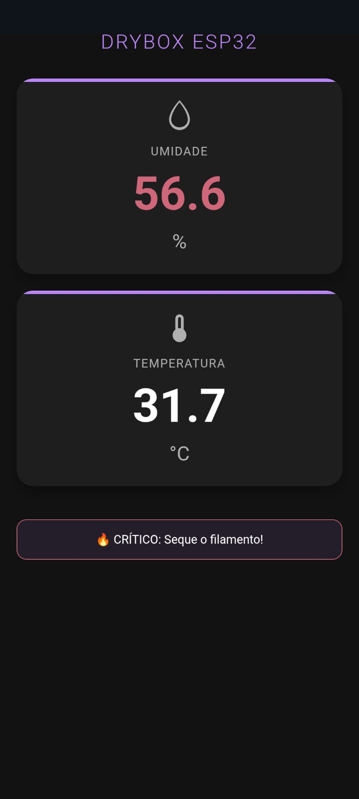 |

## Lista de Materiais

Abaixo estão listados os componentes necessários para a montagem do projeto.

| Componente | Imagem | Descrição |
| :--- | :---: | :--- |
| **Microcontrolador ESP32** | 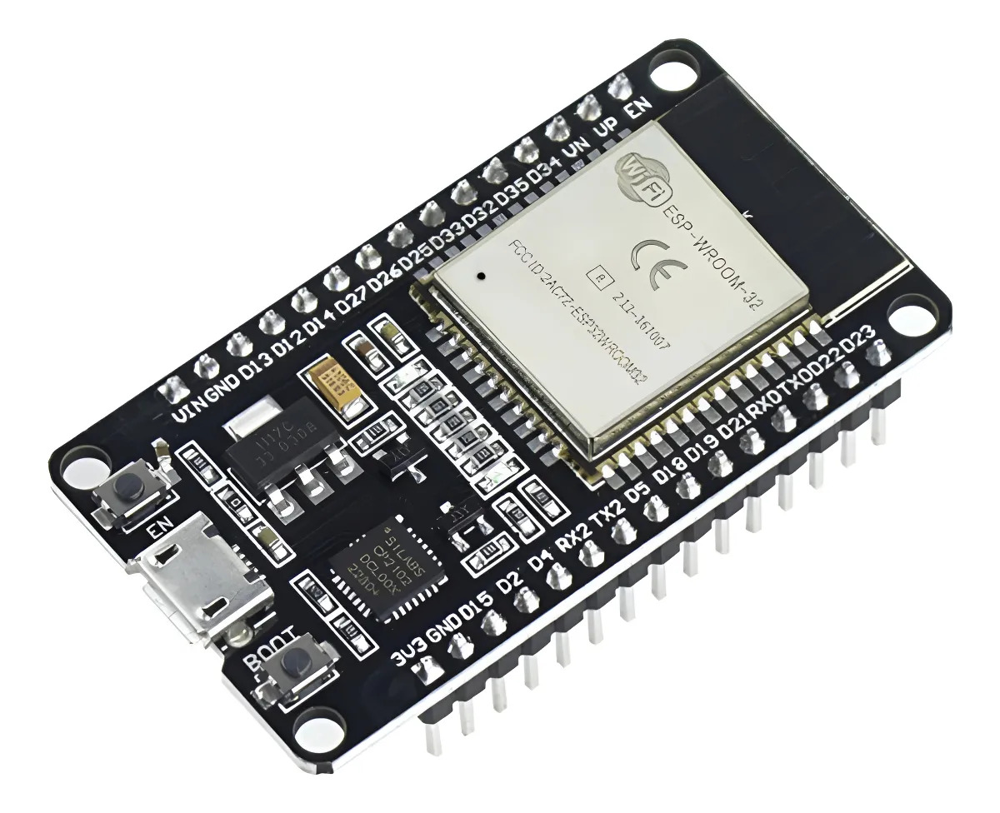 | Responsável pelo processamento e conectividade Wi-Fi. |
| **Sensor DHT22** | 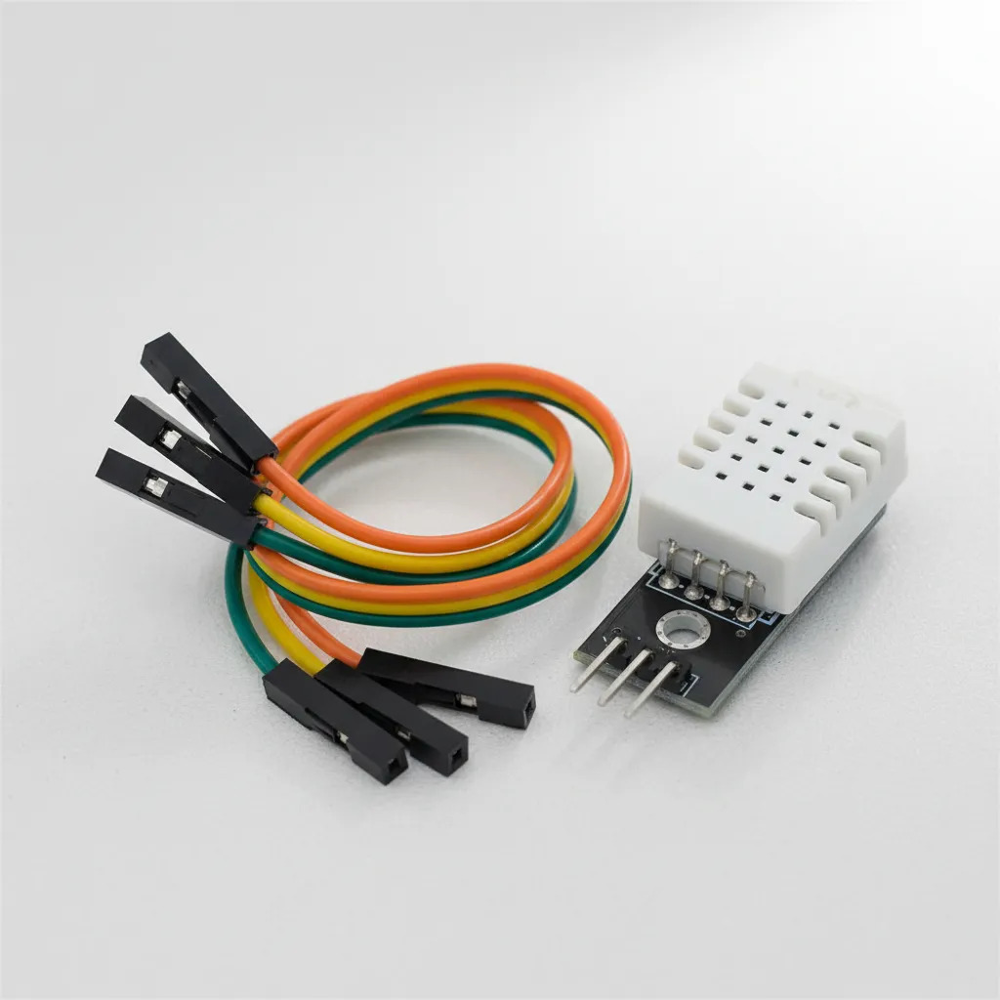 | Sensor digital para leitura precisa de temperatura e umidade. |
| **Recipiente Hermético** | 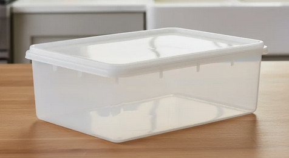 | Caixa organizadora com vedação para isolar o filamento. |
| **Desumidificador** | 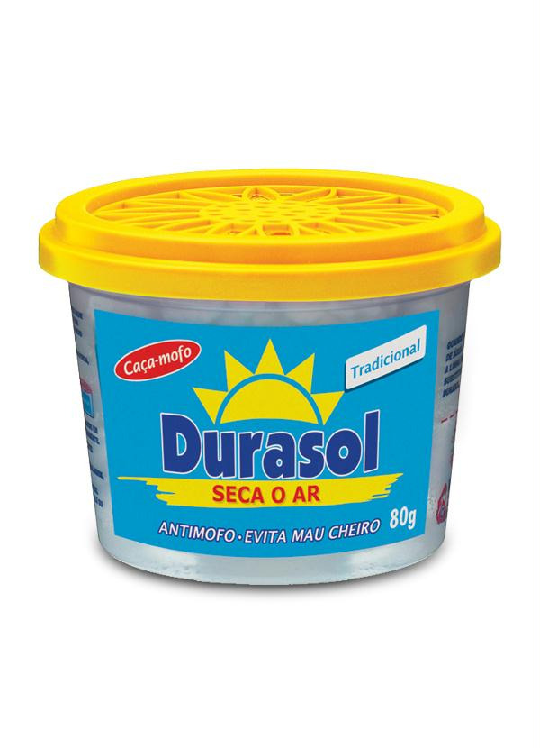 | Pote de Cloreto de Cálcio (ex: Durasol) para absorção de umidade. |
| **Tubo PTFE e Conexões** | 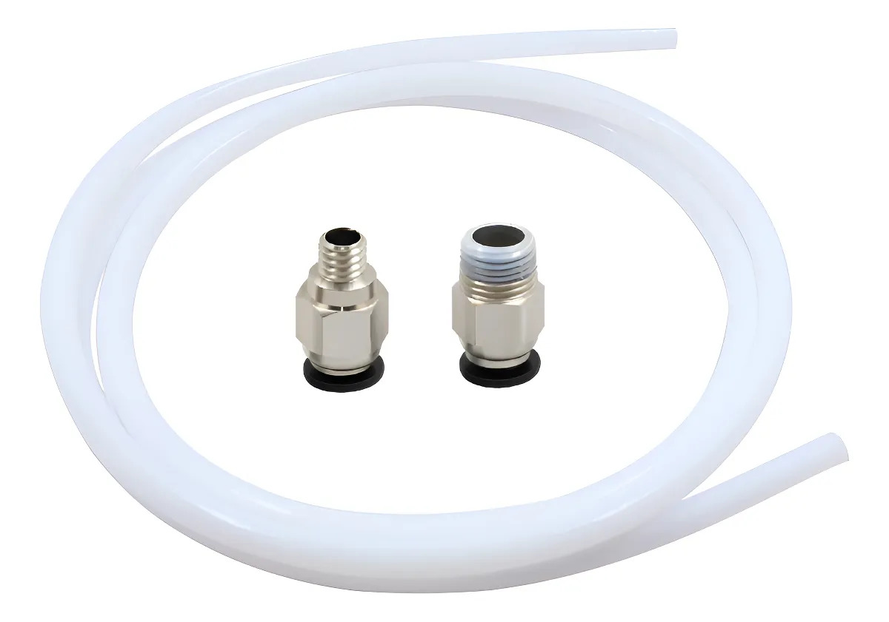 | Guia o filamento para fora da caixa sem perder a vedação. |
| **Barra Roscada** | 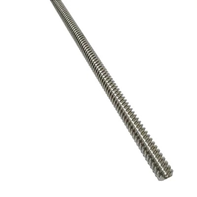 | Eixo central para suporte e rotação do carretel. |

## Peças para Impressão 3D

Os arquivos para a fabricação das peças estruturais estão disponíveis no diretório `./Peças` no formato STP.

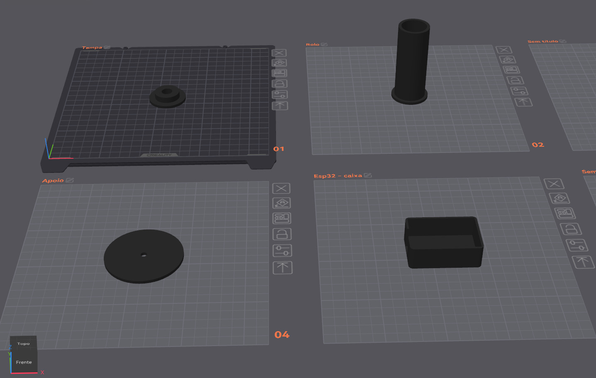
 
<i>Visão geral de todas as peças impressas.</i>

| Peça | Imagem | Arquivo | Qtd | Descrição |
| :--- | :---: | :--- | :---: | :--- |
| **Case ESP32** | 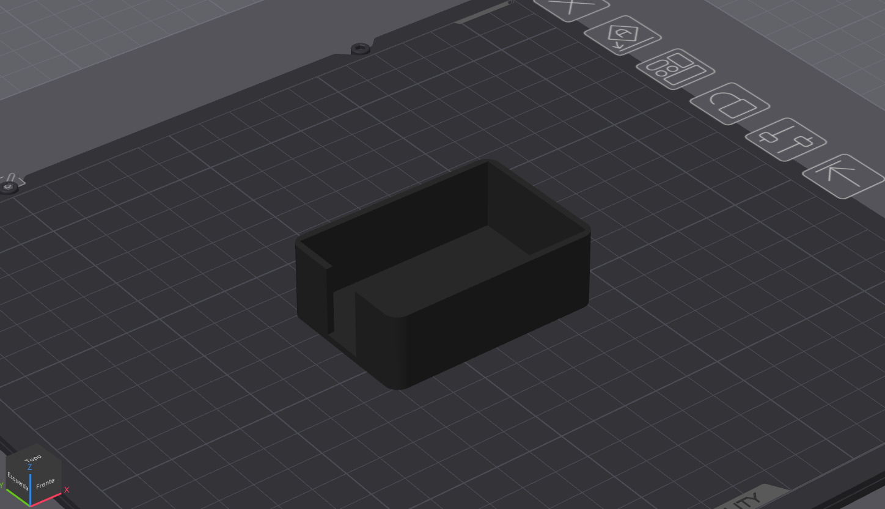 | `box-esp32-1x.stp` | 1 | Case externo para proteger a eletrônica e isolá-la do ambiente interno da caixa. |
| **Suporte Lateral** | 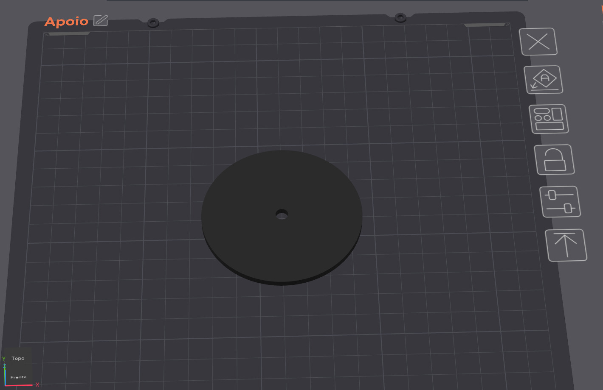 | `apoio-2x.stp` | 2 | Suportes para a barra roscada e rolamentos. Devem ser colados ou fixados na lateral interna. |
| **Adaptador de Rolo** | 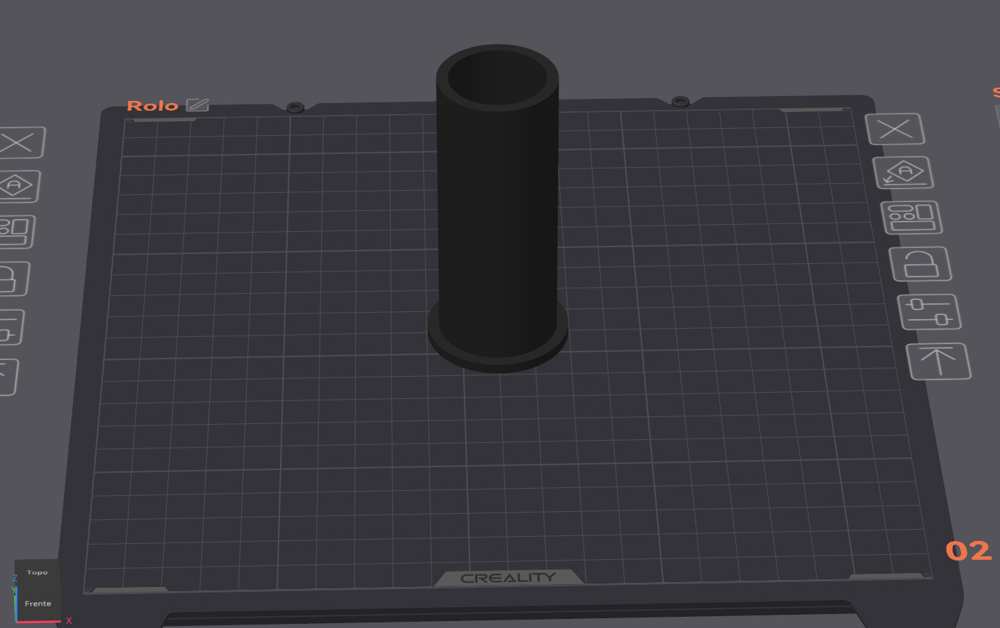 | `rolo-filamento-1x.stp` | 1 | Centralizador cônico para manter o carretel alinhado no eixo. |
| **Trava do Rolo** | 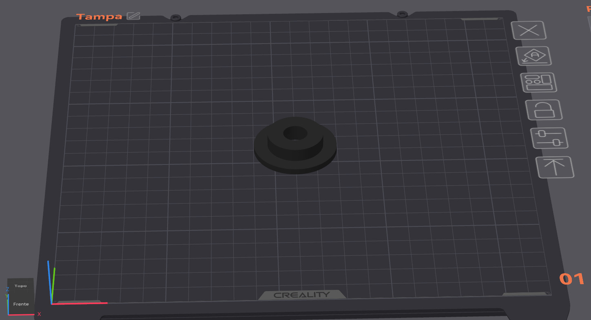 | `tampa-rolo-1x.stp` | 1 | Tampa rosqueável ou de pressão para travar o carretel no adaptador. |

## Criadores

O projeto não teria sido possível sem essas pessoas:

| Avatar | Nome |
| :---: | :--- |
|  | [Guilherme Augusto](https://github.com/gui200428) |
|  | [João Francisco B. Ferreira](https://github.com/jfscripts) |
|  | [Thales Enrico S. da Silva](https://github.com/Thales-Enrico) |
|  | [Vitor Ronald Barbist](https://github.com/ronald-barbist) |
|  | [Luccas Henrique R. da Silva](https://github.com/LuccasHenrique13) |
|  | [Miguel Arcanjo B. Motta](https://github.com/Miguelmotta) |
|  | [Matheus Gonzalez](https://github.com/Mgonzalez980) |
|  | [Higor Robert Barbist](https://github.com/higorrb) |